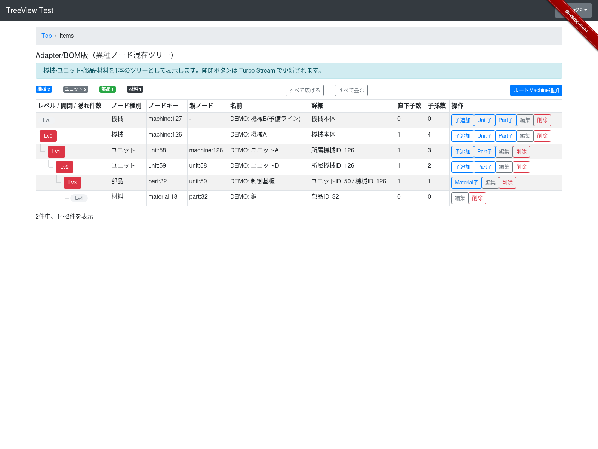

# TurboStream TreeView Test

Rails + Turbo Stream でツリー表示 UI を試作しているサンプルアプリです。  
将来的な GEM 化を見据えつつ、まずはアプリ内で `TreeView` の責務分離を整えることを目的にしています。



## デモ画面について

このリポジトリには、以下の 2 つのサンプル画面があります。

### `items`
- 自己参照モデル `Item.parent_item_id` をそのままツリー表示する画面
- Turbo Stream による開閉
- 右クリックメニューによる子系統の開閉
- Turbo Frame ベースの簡素 CRUD
- `すべて広げる` / `すべて畳む`
- root 単位のページネーション

### `machines`
- `Machine / Unit / Part / Material` を 1 本のツリーとして表示する画面
- `TreeView::GraphAdapter` を使った異種ノード混在デモ
- Turbo Stream による開閉
- Turbo Frame ベースの簡素 CRUD
- `すべて広げる` / `すべて畳む`
- root 単位のページネーション

## GEM の骨幹になるもの

このリポジトリは sample app 付きですが、GEM 化の中心として育てているのは次の部分です。

- `TreeView::Tree`
  - 親子解決、子孫数集計、ルート並び替え
- `TreeView::Traversal`
  - 子孫 ID 収集など、ツリー走査の補助
- `TreeView::GraphAdapter`
  - 異種ノードを 1 本のツリーとして扱うための接続層
- `TreeView::RenderState`
  - 画面ごとの描画状態をまとめるオブジェクト
- `TreeView::UiConfig`
  - DOM ID や path helper など、画面統合に必要な設定
- `TreeView.configure`
  - GEM 全体の既定値を置く入口

つまり、このリポジトリの本体は「デモ画面」ではなく、

- 木構造をどう解決するか
- 画面ごとの描画状態をどう持つか
- Rails の view / helper とどうつなぐか

を整理している `TreeView` コア部分です。デモ画面は、その使い方を確認するための sample app です。

## ドキュメント

- [Architecture](./docs/architecture.md)
  - `TreeView` コアと sample app の責務分離、GEM 候補とアプリ専用機能の境界を書いています。
- [GEM API Draft](./docs/gem-api.md)
  - `TreeView` が何を提供するか、`TreeView.configure`、`RenderState`、全体開閉 helper など、GEM 化に向けた公開 API 方針を書いています。
- [Setup](./docs/setup.md)
  - Docker を使った初期セットアップ、seed、ログイン情報、テスト、スクリーンショット生成手順を書いています。
- [Release](./docs/release.md)
  - production 用の起動手順と HTTPS 対応のメモを書いています。
- [Styling](./docs/styling.md)
  - TreeView の見た目を CSS 上書きで調整したい人向けに、主なクラスと調整ポイントを書いています。

## Quick Start

```bash
git clone <repository-url>
cd TurboStream-TreeViewTest
cp .env.example .env
docker compose build
docker compose run --rm app bash
bundle install
yarn
bin/rails db:create
bin/rails db:migrate
bin/rails db:seed
exit
docker compose up -d
```

詳細は [docs/setup.md](./docs/setup.md) を参照してください。

## 画面で試せること

### 共通
- ツリーの展開 / 折りたたみ
- `すべて広げる` / `すべて畳む`
- 枝付きの階層表示
- 右クリックメニューによる子系統の開閉
- Turbo Stream による画面 refresh サンプル
- root 単位のページネーション

### CRUD
- `Item`, `Machine`, `Unit`, `Part`, `Material` の新規作成
- 既存ノードに対する子追加
- 編集
- 削除
- フォームは Turbo Frame ベースのモーダル表示

## 現時点の注意

- `Kaminari` は全ノードではなく root collection にだけ適用する方針です
- README へのスクリーンショット掲載手順はまだ整理途中です
- 現状は sample app を土台にしつつ、`initial_state` と全体開閉 helper までは公開 API 方針を実装済みです

## ライセンス

未整理です。GEM 化時に合わせて明記してください。
