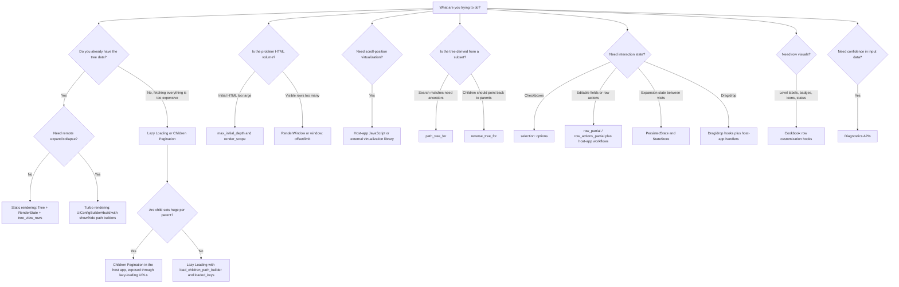

# API decision guide

Use this guide when you know what you want to build, but are not sure which TreeView API or option to start with.

TreeView APIs fall into two broad groups:

- **Render controls** change which already-known tree rows are expanded, visible, or rendered into HTML.
- **Data-loading controls** change when the host app fetches children or pages of children from the server.

Use render controls first when the data is already available. Use lazy loading or children pagination when fetching all children up front is the problem. Use host-app JavaScript when the problem is full scroll-position-driven DOM virtualization.

## Start from the use case

| I want to... | Start with | Key options or APIs | Notes |
|---|---|---|---|
| Render a simple static tree | `TreeView::Tree`, `TreeView::RenderState`, `tree_view_rows` | `records:`, `parent_id_method:`, `row_partial:`, `UiConfigBuilder#build_static` | Best first implementation when all nodes are already available and no remote expand/collapse is needed. |
| Add Turbo expand/collapse | `TreeView::UiConfigBuilder#build` | `show_descendants_path_builder`, `hide_descendants_path_builder`, `toggle_all_path_builder` | Host app routes and Turbo Stream actions own the response. TreeView builds row IDs and URLs. |
| Keep the first render small | `TreeView::RenderState` | `max_initial_depth`, `initial_expansion:`, `render_scope:` | These are render controls. They reduce initial HTML volume, not database query volume by themselves. |
| Limit which descendants can be rendered | `render_scope:` | `max_depth`, `max_leaf_distance` | Use when a page should never render beyond a chosen depth or distance from matched leaves. |
| Render only a visible slice | `tree_view_rows(..., window:)`, `tree_view_window`, `TreeView::RenderWindow` | `window: { offset:, limit: }` | Slices already-visible rows. It reduces HTML output only; it does not fetch less data by itself. |
| Avoid fetching every child up front | [Lazy Loading](lazy-loading.md) | `load_children_path_builder`, `lazy_loading: { enabled:, loaded_keys: }` | TreeView renders hooks and URLs. See the Lazy Loading docs for controller, Turbo Stream, loaded/error/retry, and authorization patterns. |
| Page very large child sets | [Children Pagination](children-pagination.md) | Lazy-loading URLs plus host-app cursor / limit / next-page strategy | TreeView has integration boundaries and hooks. See Children Pagination for cursor, limit, stable ordering, and next-page UI examples. |
| Add full virtual scrolling | Host-app JavaScript | Scroll observers, virtualization library, URL/window state | TreeView does not provide built-in DOM virtualization or infinite-scroll control. Combine it with render metadata only when useful. |
| Show search results with ancestors | `path_tree_for` | `tree.path_tree_for(matches)` | Use when matched records need enough ancestors to preserve context from root to match. |
| Show child-to-parent paths | `reverse_tree_for` | `tree.reverse_tree_for(items)` | Use when the primary display starts from children and expands toward parents. |
| Add checkbox selection | `selection:` options | `enabled`, `checkbox_name`, `selected_keys`, `disabled_keys`, `visibility`, `cascade`, `max_selected` | TreeView renders selection state and values. The host app owns the submitted business action. |
| Add editable fields inside rows | [Forms and editing rows](form-editing.md) and [Cookbook](cookbook.md#row-customization-quick-guide) | `row_partial`, `row_actions_partial`, Rails `form_with`, `fields_for`, host-app Form Objects | TreeView supports inline-editing layouts. The host app owns edit mode, validation, persistence, authorization, dirty-state handling, and Turbo workflows. |
| Add row action buttons | [Cookbook](cookbook.md#row-customization-quick-guide) | `row_actions_partial` | Recommended slot for Edit, Show, Delete, Archive, and custom host-app actions. |
| Customize level labels, badges, icons, or status visuals | [Cookbook](cookbook.md#row-customization-quick-guide) | `depth_label_builder`, `badge_builder`, `icon_builder`, `row_class_builder`, `row_data_builder` | TreeView provides rendering hooks; product-specific labels, statuses, and permissions stay in the host app. |
| Add drag-and-drop | Drag/drop row hooks | Drag attributes and row event payloads | TreeView exposes integration hooks. The host app validates and persists the move. |
| Persist expansion state | `TreeView::PersistedState`, `TreeView::StateStore` | `rails g tree_view:state:install`, persisted state model | Use when users should return to the same expanded/collapsed tree state. |
| Validate tree data and identifiers | Diagnostics APIs | node key, DOM ID, orphan, and cycle diagnostics | Use during integration, tests, or admin diagnostics before rendering invalid structures. |
| Customize row content or attributes | `row_partial`, builders | `row_class_builder`, `row_data_builder`, `row_attributes_builder` | Use host-app partials for business columns and builders for stable row metadata. |

## Flowchart

## Render controls vs data-loading controls

| Category | APIs | What they reduce | What they do not reduce |
|---|---|---|---|
| Initial expansion | `max_initial_depth`, `initial_expansion:` | Rows opened on first paint | Records loaded from the database |
| Render scope | `render_scope: { max_depth:, max_leaf_distance: }` | Descendants eligible for rendering | Host-app query cost unless the app also scopes queries |
| Windowed rendering | `window:`, `TreeView::RenderWindow` | HTML emitted for currently visible rows | Data needed to compute visibility, host-app queries, or fetched records |
| Lazy loading | `load_children_path_builder`, `lazy_loading:` | Up-front child fetching and HTML for unloaded children | Host-app controller/query implementation |
| Children pagination | Host-app pagination around lazy loading | Per-request child count | TreeView does not choose cursor or SQL strategy |
| Virtual scrolling | Host-app JavaScript or external library | DOM work tied to scroll position | TreeView does not observe scroll or virtualize DOM by itself |

## Recommended path by project stage

1. Start with [Minimal usage](minimal-usage.md) or [Usage](usage.md) and render a static tree.
2. Add [API overview](api-overview.md) concepts only when the use case needs them.
3. Use [Render Scale](render-scale.md) when HTML size or visible row count becomes the issue.
4. Use [Lazy Loading](lazy-loading.md) and [Children Pagination](children-pagination.md) when query volume or child count is the issue; those pages include copyable host-app controller, Turbo Stream, cursor, and retry patterns.
5. Add host-app virtual scrolling only when scroll-position-driven DOM virtualization is a product requirement.
6. Add [Selection](selection.md), [Forms and editing rows](form-editing.md), [Cookbook row customization](cookbook.md#row-customization-quick-guide), [Drag and Drop](drag-and-drop.md), or [Persisted State](persisted-state.md) when interaction and row customization requirements are clear.
7. Use [Tree diagnostics](tree-diagnostics.md) when node keys, DOM IDs, or tree structure need validation.

## Common combinations

| Scenario | Combination |
|---|---|
| Small admin taxonomy | Static tree + `max_initial_depth` if needed |
| Large folder browser | Lazy Loading + Children Pagination + Persisted State |
| Large scrolling browser | Host-app virtual scrolling + render/window metadata as needed |
| Search page | `path_tree_for` + render scope around matches |
| Breadcrumb-like reverse view | `reverse_tree_for` + custom row partial |
| Bulk action page | Static or Turbo rendering + `selection:` + host-app form action |
| Bulk edit page | Static or Turbo rendering + row partial form controls + host-app Form Object |
| Per-row inline edit page | Display row partials + `row_actions_partial` + host-app edit action / Turbo response + editing row partial |
| Row action menu | `row_actions_partial` + host-app routes, authorization, and action handlers |
| Status-heavy tree table | `row_class_builder` + `badge_builder` + host-app status rules |
| Reorderable hierarchy | Static or Turbo rendering + drag/drop hooks + host-app move endpoint |

## Related docs

- [API overview](api-overview.md)
- [API reference](api.md)
- [Cookbook: Row customization quick guide](cookbook.md#row-customization-quick-guide)
- [Render Scale](render-scale.md)
- [Lazy Loading](lazy-loading.md)
- [Children Pagination](children-pagination.md)
- [Filtered Trees](filtered-trees.md)
- [Selection](selection.md)
- [Forms and editing rows](form-editing.md)
- [Drag and Drop](drag-and-drop.md)
- [Persisted State](persisted-state.md)
- [Tree diagnostics](tree-diagnostics.md)
