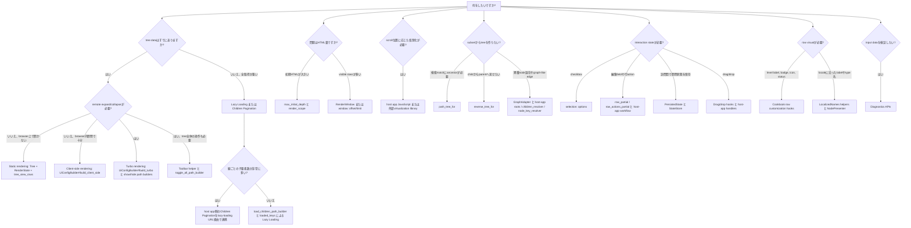

# API判断ガイド

「何を作りたいか」は決まっているが、どのTreeView APIやoptionから使えばよいか迷う場合は、このガイドを入口にしてください。

TreeViewのAPIは大きく分けると次の2種類です。

- **描画制御**: すでに手元にあるtree rowsのうち、何を開くか、何をvisibleにするか、どこまでHTMLとして描画するかを制御します。
- **データ読み込み制御**: host appが子要素や子要素のpageをいつserverから取得するかを制御します。

データがすでに取得済みなら、まず描画制御を使います。全ての子要素を先に取得すること自体が問題なら、Lazy LoadingやChildren Paginationを使います。scroll位置に応じたDOM仮想化が問題なら、host app側のJavaScriptで実装します。

## 先にtoggle modeを選ぶ

render depthやloading strategyを細かく決める前に、そのtree instanceで行をどう開閉するかを決めます。

| Mode | まず使うAPI | 向いている場面 | host appが担当すること |
|---|---|---|---|
| Static | `UiConfigBuilder#build_static` | treeをread-only snapshotとして見せたい、またはcollapsed descendantsをbrowser上で開かせない画面。 | 描画前にどのrecordsを含めるか、別画面や別actionでviewを切り替えるか。 |
| Turbo | `UiConfigBuilder#build_turbo` | 行を開くとhost app routeへrequestし、Turbo Stream responseで差し替えたい場合。あとから子要素を取得する必要がある場合。 | `show_descendants_path_builder`、`hide_descendants_path_builder`、routes、authorization、controller actions、queries、Turbo Stream responses。 |
| Client-side | `UiConfigBuilder#build_client_side` | render scope内の全行を初期HTMLに含められ、browser内のshow/hideだけで足りる場合。 | 初期HTML量、JavaScript登録、row scope、ユーザーが行を開いた後の業務action。 |

Lazy LoadingやChildren PaginationにはTurbo modeを使います。Client-side modeは初期DOMに存在する行だけを表示できます。server-side fetchingの代替にはなりません。toggle linkは表示されているが動かない場合は、症状別の逆引きとして [Troubleshooting](troubleshooting.md#toggle-links-do-not-expand-or-collapse) を参照してください。

## やりたいことから選ぶ

| やりたいこと | まず使うAPI | 主なoption / API | 補足 |
|---|---|---|---|
| 単純なstatic treeを描画したい | `TreeView::Tree`, `TreeView::RenderState`, `tree_view_rows` | `records:`, `parent_id_method:`, `row_partial:`, `UiConfigBuilder#build_static` | 全nodeが取得済みでremote expand/collapseが不要な場合の最初の実装です。 |
| Turboでexpand/collapseしたい | `TreeView::UiConfigBuilder#build_turbo` | `show_descendants_path_builder`, `hide_descendants_path_builder`, `toggle_all_path_builder` | `build` は後方互換aliasです。host appのroutesとTurbo Stream actionがresponseを担当します。 |
| tree全体のexpand/collapse toolbar actionを追加したい | [Toolbar helper](toolbar.md) | `tree_view_toolbar`, `tree_view_toolbar_actions`, `tree_view_toolbar_action_metadata`, `toggle_all_path_builder` | Expand all、Collapse all、Collapse all except current path の操作を画面に置きたい場合に使います。TreeViewはaction metadataとtoggle-all state valueを提供し、placement、label、authorization copy、route、Turbo responseはhost appが担当します。 |
| Turbo endpointなしでbrowser内だけで開閉したい | `TreeView::UiConfigBuilder#build_client_side` | `initial_state`, `initial_expansion:`, `render_scope:` | render scope内の全行を初期HTMLに含められる小〜中規模treeに向いています。 |
| 初期描画を小さくしたい | `TreeView::RenderState` | `max_initial_depth`, `initial_expansion:`, `render_scope:` | これは描画制御です。初期HTML量は減りますが、それだけでdatabase query量が減るわけではありません。 |
| 描画対象の子孫範囲を制限したい | `render_scope:` | `max_depth`, `max_leaf_distance` | ページ上で一定のdepthやmatched leavesからの距離を超えて描画したくない場合に使います。 |
| visible rowsの一部だけ描画したい | `tree_view_rows(..., window:)`, `tree_view_window`, `TreeView::RenderWindow` | `window: { offset:, limit: }` | すでにvisibleなrowsをsliceします。HTML出力量だけを減らし、それだけで取得データ量が減るわけではありません。 |
| 全ての子要素を先に取得したくない | [Lazy Loading](lazy-loading.md) | `load_children_path_builder`, `lazy_loading: { enabled:, loaded_keys: }` | TreeViewはhookとURLを描画します。controller、Turbo Stream、loaded/error/retry、authorization patternはLazy Loading docsを参照してください。 |
| 非常に大きい子要素集合をpage分割したい | [Children Pagination](children-pagination.md) | Lazy-loading URLとhost app側のcursor / limit / next-page strategy | TreeViewは連携境界とhookを提供します。cursor、limit、stable ordering、next-page UI例はChildren Pagination docsを参照してください。 |
| full virtual scrollingを追加したい | host app JavaScript | scroll observer、virtualization library、URL/window state | TreeViewは組み込みのDOM仮想化やinfinite-scroll制御を提供しません。必要に応じてrender metadataと組み合わせます。 |
| 検索結果をancestor付きで表示したい | `path_tree_for` | `tree.path_tree_for(matches)` | matchしたrecordをrootからの文脈付きで表示したい場合に使います。 |
| childからparentへ辿る表示をしたい | `reverse_tree_for` | `tree.reverse_tree_for(items)` | 子側を起点にして親方向へ展開する表示に使います。 |
| records mode のbreadcrumbを描画したい | [Breadcrumb helper](breadcrumb.md) | `tree_view_breadcrumb`, `tree.path_for(item)`, `label_builder`, `path_builder` | records mode の詳細画面で root から現在nodeまでの path を出したい場合に使います。graph-like data や複数parent候補がある場合、trail の選択は host app 側で行います。path lookup が失敗する場合は [Troubleshooting](troubleshooting.md#breadcrumb-が失敗する--親方向の-path-が見つからない) を参照してください。 |
| 異種node混在やgraph-like nodeを描画したい | [API概要: adapter mode](api-overview.md#adapter-mode) | `TreeView::GraphAdapter`, `TreeView::Tree.new(adapter:)`, `children_resolver`, `node_key_resolver` | 1つのparent id columnだけでは表しにくい、複数record class混在やgraph-like edge由来のtreeに使います。TreeViewはhost appが渡すrootとchildrenを辿ります。data model、authorization、cycle policy、保存はhost app側の責務です。 |
| checkbox selectionを追加したい | `selection:` option と host element 上の `tree-view-selection` wiring | `enabled`, `checkbox_name`, `selected_keys`, `disabled_builder`, `disabled_reason_builder`, `visibility`, `data-tree-view-selection-hidden-input-name-value`, `data-tree-view-selection-max-count-value`, `data-tree-view-selection-cascade-value`, `data-tree-view-selection-indeterminate-value` | row payload 生成、disabled reason、checkbox visibility は grouped `selection:` option 側で決めます。hidden input sync、client-side の最大選択数制限、描画済み row の cascade / indeterminate は controller value attribute 側で設定します。TreeViewはselection stateとvalueを描画しますが、送信後の業務 action は引き続き host app が担当します。 |
| 行内に編集fieldを置きたい | [Form と編集行](form-editing.md) と [Cookbook](cookbook.md#行customization-quick-guide) | `row_partial`, `row_actions_partial`, Rails `form_with`, `fields_for`, host-app Form Object | TreeViewはinline-editing layoutを支援します。edit mode、validation、persistence、authorization、dirty-state handling、Turbo workflowはhost appが担当します。 |
| 行action buttonを追加したい | [Cookbook](cookbook.md#行customization-quick-guide) | `row_actions_partial` | Edit、Show、Delete、Archive、host app固有actionの推奨slotです。 |
| level label、badge、icon、status visualをcustomizeしたい | [Cookbook](cookbook.md#行customization-quick-guide) | `depth_label_builder`, `badge_builder`, `icon_builder`, `row_class_builder`, `row_data_builder` | TreeViewは描画hookを提供します。product固有label、status、permissionはhost app側に残します。 |
| Rails I18nに沿ったrow label、badge、tooltipを出したい | [Localized names](localized-names.md) と [Cookbook](cookbook.md#row-labelbadgetooltipをlocalizeする) | `TreeView.model_name_for`, `TreeView.attribute_name_for`, `TreeView.type_name_for`, `TreeView::NodePresenter` | row visualをhost appのlocale fileに合わせたい場合に使います。TreeViewは表示名を解決し、locale内容、業務文言、どこへ表示するかはhost appが担当します。 |
| drag-and-dropを追加したい | Drag/drop row hooks | drag属性とrow event payload | TreeViewは連携hookを出します。移動のvalidationと永続化はhost appが担当します。 |
| 開閉状態を保存したい | `TreeView::PersistedState`, `TreeView::StateStore` | `rails g tree_view:state:install`, persisted state model | ユーザが再訪したときに同じ開閉状態へ戻したい場合に使います。 |
| tree dataや識別子を検証したい | Diagnostics APIs | node key、DOM ID、orphan、cycle diagnostics | integration時、test時、invalidな構造の描画前確認に使います。 |
| row内容や属性をcustomizeしたい | `row_partial`, builders | `row_class_builder`, `row_data_builder`, `row_attributes_builder` | 業務列はhost app partialで、安定したrow metadataはbuilderで設定します。 |

## Flowchart

## 描画制御とデータ読み込み制御の違い

| 種類 | API | 減らせるもの | それだけでは減らないもの |
|---|---|---|---|
| 初期展開 | `max_initial_depth`, `initial_expansion:` | 初回表示で開くrow | databaseから読み込むrecord数 |
| client-side開閉 | `build_client_side`, `tree-view-client` | 開閉時のserver round-trip | 初期HTML量。render scope内の行は初期HTMLに出力されます。 |
| 描画範囲 | `render_scope: { max_depth:, max_leaf_distance: }` | 描画対象になる子孫 | host appがqueryも絞らない限りquery costは減りません |
| windowed rendering | `window:`, `TreeView::RenderWindow` | 現在visibleなrowsから出力するHTML | visibility計算に必要なデータ、host app query、取得済みrecord数 |
| Lazy Loading | `load_children_path_builder`, `lazy_loading:` | 初期の子要素取得と未読み込み子要素のHTML | host appのcontroller / query実装 |
| Children Pagination | lazy loading周辺のhost app pagination | 1requestあたりの子要素数 | TreeViewはcursorやSQL strategyを選びません |
| Virtual scrolling | host app JavaScript または外部library | scroll位置に応じたDOM作業 | TreeViewはscroll監視やDOM仮想化を単体では行いません |

## project stageごとのおすすめ順

1. [最小利用例](minimal-usage.md) または [使い方](usage.md) から始め、static treeを描画します。
2. 必要になったuse caseに応じて [API概要](api-overview.md) の概念を足します。
3. HTML量やvisible row数が問題になったら [Render Scale](render-scale.md) を使います。
4. query量や子要素数が問題になったら [Lazy Loading](lazy-loading.md) と [Children Pagination](children-pagination.md) を使います。これらのページには、host app controller、Turbo Stream、cursor、retry patternのコピー可能な例があります。
5. 1つのparent id columnだけでは扱いにくい異種recordやgraph-like edgeがある場合は [GraphAdapter adapter mode](api-overview.md#adapter-mode) を使います。
6. dataは取得済みで、初期HTML量を許容でき、Turbo endpointが過剰な場合は `build_client_side` を使います。
7. scroll位置に応じたDOM仮想化がproduct要件になった場合だけ、host app側でvirtual scrollingを追加します。
8. interaction要件やrow customization要件が固まったら [Selection](selection.md)、[Form と編集行](form-editing.md)、[Cookbook row customization](cookbook.md#行customization-quick-guide)、[Localized names](localized-names.md)、[Toolbar helper](toolbar.md)、[Breadcrumb helper](breadcrumb.md)、[Drag and Drop](drag-and-drop.md)、[Persisted State](persisted-state.md) を追加します。
9. node key、DOM ID、tree構造を検証したい場合は [Tree diagnostics](tree-diagnostics.md) を使います。

## よくある組み合わせ

| Scenario | 組み合わせ |
|---|---|
| 小さな管理用taxonomy | Static tree + 必要に応じて `max_initial_depth` |
| 小さなdocs sidebarのlocal開閉 | Client-side mode + `initial_state: :collapsed` + 必要に応じてrender scope |
| 大きなfolder browser | Lazy Loading + Children Pagination + Persisted State |
| 異種nodeを含むproject workspace | GraphAdapter + 安定した `node_key_resolver` + host-app row partial / presenter |
| 大きなscrolling browser | host app virtual scrolling + 必要に応じてrender/window metadata |
| 検索ページ | `path_tree_for` + match周辺のrender scope |
| breadcrumb風のreverse view | `reverse_tree_for` + custom row partial |
| records mode の詳細画面breadcrumb | Breadcrumb helper + host-app label/path builders |
| bulk action page | StaticまたはTurbo rendering + `selection:` + host-app form action |
| bulk edit page | StaticまたはTurbo rendering + row partial form controls + host-app Form Object |
| per-row inline edit page | 表示用row partial + `row_actions_partial` + host-app edit action / Turbo response + 編集用row partial |
| tree全体のaction toolbar | Turbo rendering + `toggle_all_path_builder` + `tree_view_toolbar` + host-app placement / authorization |
| row action menu | `row_actions_partial` + host-app route、authorization、action handler |
| statusが多いtree table | `row_class_builder` + `badge_builder` + host-app status rules |
| localized row display | `TreeView::NodePresenter` + LocalizedNames helpers + host-app locale files |
| 並び替え可能な階層 | StaticまたはTurbo rendering + drag/drop hooks + host-app move endpoint |

## 関連docs

- [API概要](api-overview.md)
- [API概要: adapter mode](api-overview.md#adapter-mode)
- [API仕様](api.md)
- [Cookbook: 行customization quick guide](cookbook.md#行customization-quick-guide)
- [Localized names](localized-names.md)
- [Toolbar helper](toolbar.md)
- [Breadcrumb helper](breadcrumb.md)
- [Toolbar actions mockup](../mockups/toolbar-actions.html)
- [Render Scale](render-scale.md)
- [Lazy Loading](lazy-loading.md)
- [Children Pagination](children-pagination.md)
- [Filtered Trees](filtered-trees.md)
- [Selection](selection.md)
- [Form と編集行](form-editing.md)
- [Drag and Drop](drag-and-drop.md)
- [Persisted State](persisted-state.md)
- [Tree diagnostics](tree-diagnostics.md)
- [Troubleshooting](troubleshooting.md)
