# API判断ガイド

「何を作りたいか」は決まっているが、どのTreeView APIやoptionから使えばよいか迷う場合は、このガイドを入口にしてください。

TreeViewのAPIは大きく分けると次の2種類です。

- **描画制御**: すでに手元にあるtree rowsのうち、何を開くか、何をvisibleにするか、どこまでHTMLとして描画するかを制御します。
- **データ読み込み制御**: host appが子要素や子要素のpageをいつserverから取得するかを制御します。

データがすでに取得済みなら、まず描画制御を使います。全ての子要素を先に取得すること自体が問題なら、Lazy LoadingやChildren Paginationを使います。scroll位置に応じたDOM仮想化が問題なら、host app側のJavaScriptで実装します。

## やりたいことから選ぶ

| やりたいこと | まず使うAPI | 主なoption / API | 補足 |
|---|---|---|---|
| 単純なstatic treeを描画したい | `TreeView::Tree`, `TreeView::RenderState`, `tree_view_rows` | `records:`, `parent_id_method:`, `row_partial:`, `UiConfigBuilder#build_static` | 全nodeが取得済みでremote expand/collapseが不要な場合の最初の実装です。 |
| Turboでexpand/collapseしたい | `TreeView::UiConfigBuilder#build` | `show_descendants_path_builder`, `hide_descendants_path_builder`, `toggle_all_path_builder` | host appのroutesとTurbo Stream actionがresponseを担当します。TreeViewはrow IDとURLを組み立てます。 |
| 初期描画を小さくしたい | `TreeView::RenderState` | `max_initial_depth`, `initial_expansion:`, `render_scope:` | これは描画制御です。初期HTML量は減りますが、それだけでdatabase query量が減るわけではありません。 |
| 描画対象の子孫範囲を制限したい | `render_scope:` | `max_depth`, `max_leaf_distance` | ページ上で一定のdepthやmatched leavesからの距離を超えて描画したくない場合に使います。 |
| visible rowsの一部だけ描画したい | `tree_view_rows(..., window:)`, `tree_view_window`, `TreeView::RenderWindow` | `window: { offset:, limit: }` | すでにvisibleなrowsをsliceします。HTML出力量だけを減らし、それだけで取得データ量が減るわけではありません。 |
| 全ての子要素を先に取得したくない | Lazy Loading | `load_children_path_builder`, `lazy_loading: { enabled:, loaded_keys: }` | TreeViewはhookとURLを描画します。controller action、query、authorization、Turbo responseはhost appが実装します。 |
| 非常に大きい子要素集合をpage分割したい | Children Pagination | Lazy-loading URLとhost app側のcursor / limit / next-page strategy | TreeViewは連携境界とhookを提供します。pagination stateとfetch behaviorはhost appが担当します。 |
| full virtual scrollingを追加したい | host app JavaScript | scroll observer、virtualization library、URL/window state | TreeViewは組み込みのDOM仮想化やinfinite-scroll制御を提供しません。必要に応じてrender metadataと組み合わせます。 |
| 検索結果をancestor付きで表示したい | `path_tree_for` | `tree.path_tree_for(matches)` | matchしたrecordをrootからの文脈付きで表示したい場合に使います。 |
| childからparentへ辿る表示をしたい | `reverse_tree_for` | `tree.reverse_tree_for(items)` | 子側を起点にして親方向へ展開する表示に使います。 |
| checkbox selectionを追加したい | `selection:` options | `enabled`, `checkbox_name`, `selected_keys`, `disabled_keys`, `visibility`, `cascade`, `max_selected` | TreeViewはselection stateとvalueを描画します。送信後の業務処理はhost appが担当します。 |
| 行内に編集fieldを置きたい | [Form と編集行](form-editing.md) と [Cookbook](cookbook.md#行customization-quick-guide) | `row_partial`, `row_actions_partial`, Rails `form_with`, `fields_for`, host-app Form Object | TreeViewはinline-editing layoutを支援します。edit mode、validation、persistence、authorization、dirty-state handling、Turbo workflowはhost appが担当します。 |
| 行action buttonを追加したい | [Cookbook](cookbook.md#行customization-quick-guide) | `row_actions_partial` | Edit、Show、Delete、Archive、host app固有actionの推奨slotです。 |
| level label、badge、icon、status visualをcustomizeしたい | [Cookbook](cookbook.md#行customization-quick-guide) | `depth_label_builder`, `badge_builder`, `icon_builder`, `row_class_builder`, `row_data_builder` | TreeViewは描画hookを提供します。product固有label、status、permissionはhost app側に残します。 |
| drag-and-dropを追加したい | Drag/drop row hooks | drag属性とrow event payload | TreeViewは連携hookを出します。移動のvalidationと永続化はhost appが担当します。 |
| 開閉状態を保存したい | `TreeView::PersistedState`, `TreeView::StateStore` | `rails g tree_view:state:install`, persisted state model | ユーザが再訪したときに同じ開閉状態へ戻したい場合に使います。 |
| tree dataや識別子を検証したい | Diagnostics APIs | node key、DOM ID、orphan、cycle diagnostics | integration時、test時、invalidな構造の描画前確認に使います。 |
| row内容や属性をcustomizeしたい | `row_partial`, builders | `row_class_builder`, `row_data_builder`, `row_attributes_builder` | 業務列はhost app partialで、安定したrow metadataはbuilderで設定します。 |

## Flowchart

```mermaid
flowchart TD
  A[何をしたいですか?]
  A --> B{tree dataはすでにありますか?}
  B -->|はい| C{remote expand/collapseが必要?}
  C -->|いいえ| D[Static rendering: Tree + RenderState + tree_view_rows]
  C -->|はい| E[Turbo rendering: UiConfigBuilder#build と show/hide path builders]
  B -->|いいえ、全取得が重い| F[Lazy Loading または Children Pagination]
  F --> G{親ごとの子要素数が非常に多い?}
  G -->|はい| H[host app側のChildren Paginationをlazy-loading URL経由で連携]
  G -->|いいえ| I[load_children_path_builder と loaded_keys による Lazy Loading]
  A --> J{問題はHTML量ですか?}
  J -->|初期HTMLが大きい| K[max_initial_depth と render_scope]
  J -->|visible rowsが多い| L[RenderWindow または window: offset/limit]
  A --> V{scroll位置に応じた仮想化が必要?}
  V -->|はい| W[host app JavaScript または外部virtualization library]
  A --> M{subsetからtreeを作りたい?}
  M -->|検索matchにancestorが必要| N[path_tree_for]
  M -->|childからparentへ見せたい| O[reverse_tree_for]
  A --> P{interaction stateが必要?}
  P -->|checkbox| Q[selection: options]
  P -->|編集fieldや行action| X[row_partial / row_actions_partial と host-app workflow]
  P -->|訪問間で開閉状態を保存| R[PersistedState と StateStore]
  P -->|drag/drop| S[Drag/drop hooks と host-app handlers]
  A --> Y{row visualが必要?}
  Y -->|level label, badge, icon, status| Z[Cookbook row customization hooks]
  A --> T{input dataを検証したい?}
  T -->|はい| U[Diagnostics APIs]
```

## 描画制御とデータ読み込み制御の違い

| 種類 | API | 減らせるもの | それだけでは減らないもの |
|---|---|---|---|
| 初期展開 | `max_initial_depth`, `initial_expansion:` | 初回表示で開くrow | databaseから読み込むrecord数 |
| 描画範囲 | `render_scope: { max_depth:, max_leaf_distance: }` | 描画対象になる子孫 | host appがqueryも絞らない限りquery costは減りません |
| windowed rendering | `window:`, `TreeView::RenderWindow` | 現在visibleなrowsから出力するHTML | visibility計算に必要なデータ、host app query、取得済みrecord数 |
| Lazy Loading | `load_children_path_builder`, `lazy_loading:` | 初期の子要素取得と未読み込み子要素のHTML | host appのcontroller / query実装 |
| Children Pagination | lazy loading周辺のhost app pagination | 1requestあたりの子要素数 | TreeViewはcursorやSQL strategyを選びません |
| Virtual scrolling | host app JavaScript または外部library | scroll位置に応じたDOM作業 | TreeViewはscroll監視やDOM仮想化を単体では行いません |

## project stageごとのおすすめ順

1. [最小利用例](minimal-usage.md) または [使い方](usage.md) から始め、static treeを描画します。
2. 必要になったuse caseに応じて [API概要](api-overview.md) の概念を足します。
3. HTML量やvisible row数が問題になったら [Render Scale](render-scale.md) を使います。
4. query量や子要素数が問題になったら [Lazy Loading](lazy-loading.md) と [Children Pagination](children-pagination.md) を使います。
5. scroll位置に応じたDOM仮想化がproduct要件になった場合だけ、host app側でvirtual scrollingを追加します。
6. interaction要件やrow customization要件が固まったら [Selection](selection.md)、[Form と編集行](form-editing.md)、[Cookbook row customization](cookbook.md#行customization-quick-guide)、[Drag and Drop](drag-and-drop.md)、[Persisted State](persisted-state.md) を追加します。
7. node key、DOM ID、tree構造を検証したい場合は [Tree diagnostics](tree-diagnostics.md) を使います。

## よくある組み合わせ

| Scenario | 組み合わせ |
|---|---|
| 小さな管理用taxonomy | Static tree + 必要に応じて `max_initial_depth` |
| 大きなfolder browser | Lazy Loading + Children Pagination + Persisted State |
| 大きなscrolling browser | host app virtual scrolling + 必要に応じてrender/window metadata |
| 検索ページ | `path_tree_for` + match周辺のrender scope |
| breadcrumb風のreverse view | `reverse_tree_for` + custom row partial |
| bulk action page | StaticまたはTurbo rendering + `selection:` + host-app form action |
| bulk edit page | StaticまたはTurbo rendering + row partial form controls + host-app Form Object |
| per-row inline edit page | 表示用row partial + `row_actions_partial` + host-app edit action / Turbo response + 編集用row partial |
| row action menu | `row_actions_partial` + host-app route、authorization、action handler |
| statusが多いtree table | `row_class_builder` + `badge_builder` + host-app status rules |
| 並び替え可能な階層 | StaticまたはTurbo rendering + drag/drop hooks + host-app move endpoint |

## 関連docs

- [API概要](api-overview.md)
- [API仕様](api.md)
- [Cookbook: 行customization quick guide](cookbook.md#行customization-quick-guide)
- [Render Scale](render-scale.md)
- [Lazy Loading](lazy-loading.md)
- [Children Pagination](children-pagination.md)
- [Filtered Trees](filtered-trees.md)
- [Selection](selection.md)
- [Form と編集行](form-editing.md)
- [Drag and Drop](drag-and-drop.md)
- [Persisted State](persisted-state.md)
- [Tree diagnostics](tree-diagnostics.md)
